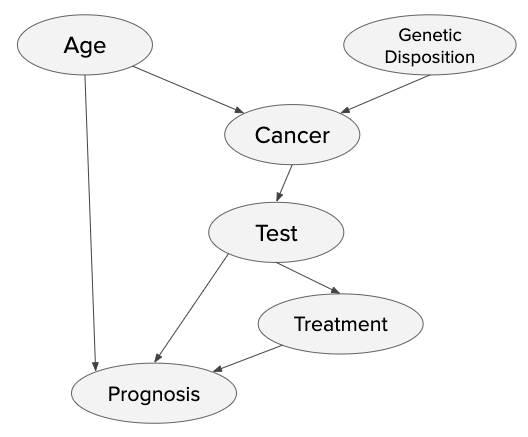

# Assignment 5—Bayes Nets

__NOTE: If you're reading this with github's Markdown renderer, you're going to see a lot
of \$'s all over the place because it can't handle \LaTeX. You should read the
README.pdf, instead.__

## Context

Up until now, the reasoning that we've done has relied on us being _certain_ about the
state of the world—we _knew_ that Willie wasn't on stage, or our basketball team will never win, or so on. Occasionally, we ran across pieces of information that weren't explicitly, but we've
assumed a closed world and the law of the excluded middle, so life hasn't been _too_ complicated for us.

Unfortunately, many situations (robotics, medicine, criminal justice, economics, etc.)
don't afford us with perfect knowledge of the world, nor are we granted the liberty of
assuming state just because we're ignorant of some particulars. We need to be able to
reason about situations where we _don't_ have complete information, just a few estimates
for how certain pieces fit together.

In the current scenario, you have been hired by the Wildcat-Medicine oncology department to analyze
current data of patients, and help provide doctors with more accurate chances of survival. The data
presented by the department is included in the `cancer_data.csv`, and includes data about a patients
`Age`, `Genes`, `Cancer`, `Test`, `Treatment` and `Prognosis`. Each columns is described below:
* `Age` is the given age of a patient.
* `Genes` is information about whether the patient is genetically predisposed to have cancer. This is represented as a `T` or `F` value
* `Cancer` is the value used to represent if the patient as Cancer or not. This is represented as a `T` or `F` value
* `Test` is a data-point to see if the patient is tested positive or negative for Cancer. This is represented as `N` or `P`
* `Treatment` is a data-point if the patient has received treatment yet or not. This is represented as a `T` or `F` value
* `Prognosis` is the time for current patient to recover. The time will be 1, 3 or 5 years, and is represented in the data as 1, 3 or 5.

When we want to reason about uncertainty we can turn to Bayesian networks as our tool of
choice. Bayes nets, in a nutshell, lets us use a bit of math to reason about the
probability of a particular hypothesis being true (or false) given a set of evidence.
Hypotheses are states of the world that we want to reason about, and they include things
like, "does this patient have HIV?," "is there a clear path across this room?," and the
infamous "am I being robbed or is this an earthquake?" Evidence is world state that we
know to be one way or another, such as "I know there are no chairs here," "the patient
has this set of symptoms," and so on.

We reason about hypotheses (whether or not they hold) given evidence, and for bayes nets
in particular this manifests as questions like, "what is the probability that is isn't
raining, given that the grass is wet and it's cloudy?"


## Your Task

You have two tasks: construct the Bayes Net from the given data and implement an `ask` function.

### Constructing Bayes Net

To construct the Bayes Net, you will calculate the probabilities in the data and assemble the network.
You are given the structure of the network, shown in the image below.



You need to calculate the conditional probability tables for each node, instantiate the node and add it to the Bayes Net.
Remember that nodes that have no incoming arrows have no conditions, and thus the probability is simply the proportion of
the data that matches the given criteria.  For the other nodes, you will need to calculate the conditional probabilities 
from the data.

### Implementing ask

Right now, `ask` doesn't do anything, but it needs to return the probability of a hypothesis given some evidence: P(H|E).  
The function takes four arguments:
* `var` is the name of the hypothesis variable, this could be any of the data-points from the `cancer_data.csv`, i.e. `Age`, `Genes`, etc.
* `value` indicates what value in the hypothesis variable are we looking for, this would be the corresponding values for each variable type, i.e. `Tests` would be `N` or `P`, `Prognosis` would be `1`, `3` or `5`, `Age` would be `Above 55` or `<= 55`, and `Cancer`, `Genes` and `Treatment` would be `True` or `False`.
* `evidence` is the set of variables known to be `True` or `False` with a given probability.
* `bn` is the `BayesNet` (in the provided module) pertaining to the
problem.

To calculate P(H|E), `ask` should calculate and return $\frac{P(H,E)}{\alpha}$, where:

* $P(H,E)$ is the joint probability of the hypothesis (`var` = `value`) and the
  evidence (`evidence`), and

* $\alpha$ is the normalization constant (the joint probability of $\neg$hypothesis and the
  evidence).

See below for more details on calculate $P(H,E)$ and $\alpha$.


## Testing

There provided tests in main.py.  You should be able to easily create more test cases with this model.  Additionally, you are encouaged to create your own instance of BayesNet that models a different domain (e.g., cavities, traffic, exam grades, or the alarm burglar example from class).

For grading the assignment we will be using the same data as in the `cancer_data.csv`.


## Notes

### On Joint Probability

To calculate the joint probability, we can break things down into terms that we can just lookup in the BayesNet.  For example, the Burglary model in class does not represent $P(b,e,a)$, but it does have $P(b)$, $P(e)$, and $P(a|b,e)$.  
We can handle this recursively by recognizing the following:
	$P(b,e,a) = P(b)P(e,a|b)$ (This is called the Chain Rule).
Similarly, we know that $P(e,a|b) = P(e|b)P(a|b,e)$.

When calculating the joint probability, we need to include all the variables that may influence the final result.  This includes all the variables that are parents of the variables in the call to `ask`.  For example, in calculating P(b,j,m), we need to include A and E (whose values we do not know; more on that in a bit). In fact, we can add in all the variables in the BayesNet, as the extra unknown variables will not affect the final result. They only add a little extra computation.

To implement this recursion you may want to introduce a new function. That function takes the list of variables in the joint probability and the collection of all known variable values.  For example, for $P(e|a,b)$, the function initially takes the list of all of the variables in the bayes net as the list of variables.  The known variable values can be represented with the dictionary `{'E':True, 'A': True, 'B':True}`.

This new function should handle the following conditions:
* Recursion is done if there are no more variables in the list.
* The next variable in the list has a known value (it is in the evidence).
* The value of the next variable is not known.

In the case where the next variable has a known value, lookup the probability in the CPT using the function `probability` on the BayesNode.
Then recurse on the rest of the variables.

If the value of the next variable is not known, we need to compute the sum of the joint probabilities when the unknown is True or False. In other words, when trying to find out $P(B,e,a)$ given unknown B and known e and a, $P(B,e,a)=P(b,e,a) + P(\neg b,e,a) = P(b)P(e,a|b) +P(\neg b)P(e,a|\neg b)$.  For each of the two possibilities, lookup the probability in the CPT and recurse.  Note that when recursing, we have now defined a value for the first variable, and this value needs to be included in the recursive call.

In calculating the joint probability, it is best to process the variables orderly.  If the list of variables is ordered such that the parent of any variable precedes its children, then when processing the child, we will already know that value.  For example, in calculating $P(a,B,e)$, if we order the variables such that we calculate $P(B,e,a)$, then when processing `a`, we will have specified a value for `B` and can thus lookup the value of $P(a|b,e)$.

To get the list of variables in order and to get the whole list of variables, use `BayesNet.variables`.


### Variables and known values

In code, we represent the values of variables as a dictionary keyed on the _name_ of the variable.  The value of the dictionary entry is either `True` or `False` for some, `Positive` or `Negative` for `Test`, and `1`, `3`, or `5`, for `Prognosis`.

An example:

```
{
  'Age': True,
  'Genes': False,
  'Cancer': True,
  'Test': 'Positive',
  'Treatment': False,
  'Prognosis': 3
}
```

This representation is used for the `evidence` argument in the call to `ask`.
In making your recurive function call, you will want to take the given evidence and update it (in the 3rd case described above).
You may notice that plenty of variables are going to be left out, and this is okay, as Bayes rule works just fine
with unknowns (since that's the point...).


### On The Normalization Constant

The normalization constant is the sum of: (1) the joint probability of the evidence and
hypothesis and (2) the joint probability of _not_ the hypothesis and the evidence. For
example, the normalization constant $\alpha$ for $P(a|b)$ is: $$\alpha = P(a,b) + P(\neg a,b)$$


### On Making Probabilities Using the Data

In the CSV file, `cancer_data.csv`, we have exactly 10,000 patient records that are row separated. So each row is one record where the columns that are comma-separated are defined on row 0: `Age`, `Genes`, `Cancer`, `Test`, `Treatment`, `Prognosis`. This data needs to be loaded and used to calculate the probabilities used in your Bayes Net.  The initial steps in processing this data has been done for you and can be found in the function `makeCancerNet()`.


For some nodes, you need to translate the raw data in `cancer_data.csv` into a more useable form.
For each variable in the data that is `T` and `F`, you need to construct a BayesNode that has a sample space of `True` and `False`.
For the age data, you need to split it such that all ages > 55 correspond with `True`, otherwise the age is `False`.  
For example, if a record has the following:

```
Age, Genes, Cancer, Test, Treatment, Prognosis
56, T, F, N, F, 5
```

this should be interprested as the following

```
Age, Genes, Cancer, Test, Treatment, Prognosis
True, True, False, Negative, False, 5
```

Calculating the conditional probabilities is essentially a task involving tallying.  To try to simplify this task,
we have provided examples on how to process the data using `pandas`.  If you python installation does not already
have `pandas`, you will need to install it:

``pip install pandas``

You can filter a pandas DataFrame by creating rules and applying the rule.  The following rule can be used to get
all of the records where Genes is `T`:

```
gen_rule = df['Genes'] == 'T'
```

You then need to apply this rule to the original DataFrame, now getting a smaller DataFrame that only has records that
match the rule.

```
genes_df = df[gen_rule]
```

The length of this DataFrame will tell you how many records have Genes with a value of `T`.

Once you have calculated the conditional probability, you need to create the corresponding BayesNode and add it to the BayesNet.


### BayesNode and BayesNet

A `BayesNet` consists of multiple `BayesNode`s. When a `BayesNode` is added to the `BayesNet`, the `BayesNet` stores the entire node in a list called `variables` and the name of the node in a list called `variable_names`. A `BayesNet` has two functions: `add` and `get_var`.

Each `BayesNode` consists of a `name` of the random variable, a list of `parents` (parent nodes in the net), sample `space` describing the set of possible values for the variable, and `cpt` (conditional probability table). A `BayesNode` has one function called `probability`, which uses it's conditional probability table to calculate the probability of this `BayesNode`. For the given hypothesis and evidence, `BayesNode.probability(hypothesis, evidence)` returns the conditional probability by calculating it with the help of `cpt`.

